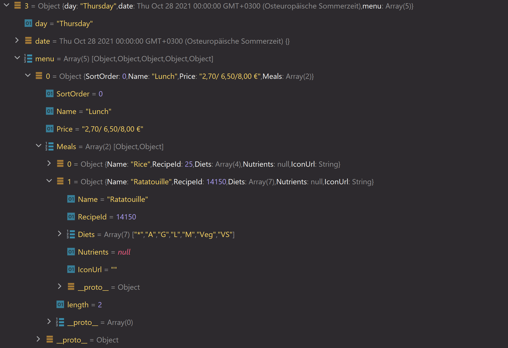

# Meal object structure for one day

And this object is either 5 or 7 times available in an array returned from the scraper, depending on whether there is an actual entry for that.

Tips for usage:
Use the name inside the Meals array to determine the actual name. Fazer has only 'Lunch' written in the menu object's name field.
```json
{
  "day": String,
  "date": Date Object (see JS doc),
  "menu": 
  [
    {
      "Name": String,
      "Price": String,
      "Meals": 
      [
        {
          "Name": String,
          "RecipeId": Number (Only Fazer),
          "Diets": 
          [
            String,
            String,
            ...
          ]
        }
      ]
    }
  ]
}
```

An example for the fazer restaurant for thursday could look like this:
